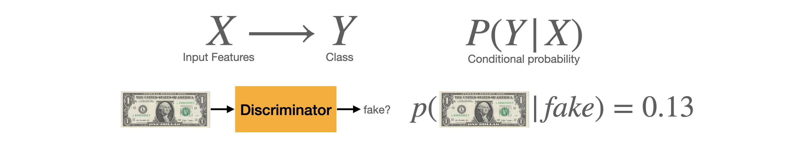
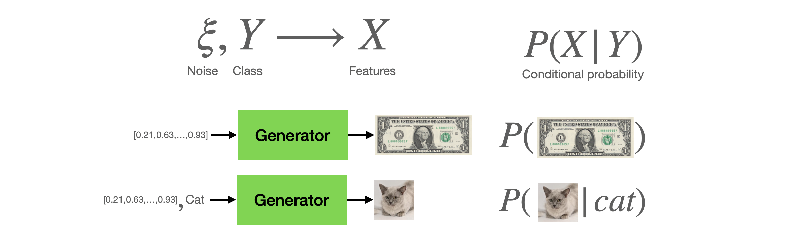
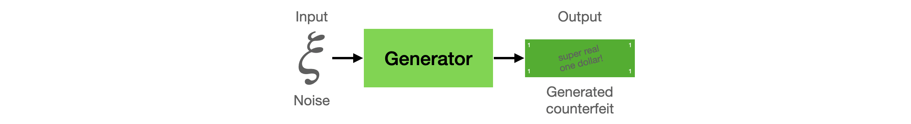
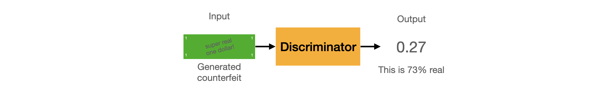
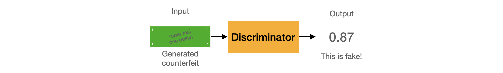
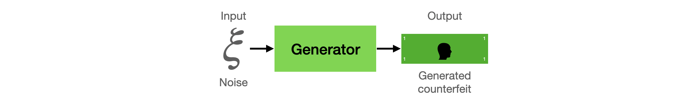

# Intuition Behind GANs

Generative adversarial networks (GANs) are powerful models that learn to produce realistic objects that are difficult to distinguish from existing real ones, such as images and audio (speech/music). In this tutorial, we will look at the basic structure of GANs to gain some intuition about how GANs models work. We will look at the [original paper](https://github.com/jinglescode/generative-adversarial-networks/blob/main/tutorials/01%20Intuition%20Behind%20GANs/assets/Generative%20Adversarial%20Networks.pdf) introducing GANs by Ian Goodfellow et al.

A GAN model has two main parts, a **generator**, and a **discriminator**; these are two separate neural networks. The generator learns to generate fakes that look real to fool the discriminator. And the discriminator learns to distinguish between what's real and what's fake. So you can think of the generator as a counterfeiter and the discriminator as a police officer. So the *generator* forges counterfeit bills to try to look as realistic as possible, and it does this in the hopes of fooling the *discriminator*. While the *discriminator* learns and gets better at identifying real and fake bills.

## Discriminator

A discriminator is like a police officer who is being trained to spot counterfeit money. Its job is to look at a picture and tell us if the photo contains real money. Since we are looking at pictures, this neural network takes in an image and then outputs a single value — in this case, whether the image contains a picture of real money (or not).

As you can see, the discriminative model here is a convolutional neural network used for classification. They take a set of features (`X`), a batch of images, and learn to distinguish between classes (`Y`), in this case, *real* or *fake*. 

In other words, they try to model the probability of class `Y` given a set of features `X`. It starts off being terrible at distinguishing real and fake money, but it learns and gets better at classifying real and fake during the training process.

We will look at how [discriminator](https://github.com/jinglescode/generative-adversarial-networks/tree/main/tutorials/02%20Discriminator) works in the next tutorial.

## Generator

On the other hand, a generator is a counterfeiter who is learning how to create fake money. Unlike the discriminator that takes in an image and output a value, a generator receives input features and outputs an image. There are two input features that we fed into the generator, 1) a class (`Y`), and 2) a noise vector.

**Class**. We may want our model to learn to generate several different objects. Sometimes, we don't want just to generate a random bill, we want the model to generate One Dollar, or Five Dollar, or Twenty Dollar as we choose. But if we are only generating one class, just generate any bill, then we do not need this class `Y` input.

**Noise**. Sometimes, we need the model to generate diverse representations of a class. For example, we aim to create a variety of realistic dogs; the noise ensures that what was generated is always something different because consistently generating the same dog is not interesting. This random noise that also goes in as an input can help us create images with various features. Sometimes is a dog standing up or lying down. Sometimes it has pointy ears, and sometimes its tongue is sticking out. With the added noise, these models would generate realistic and diverse representations. 

In the beginning, the generator will not generate something realistic; it learns as it manages to fool the discriminator until we get a good generator and can produce realistic images that we want. Additionally, the generator was not fed with the real images for training, so this is very tough for generators to learn, especially in the beginning.

We will look at how [generator](https://github.com/jinglescode/generative-adversarial-networks/tree/main/tutorials/03%20Generator) works in this tutorial.

## Working together (or compete)

Both networks are bad at their tasks at the start, but during training, they compete against each other and learn from each other until they reach a point where we do not need the discriminator anymore. We can then use the generator; given any class (`Y`) and any random noise, it can produce a realistic image. 

Now we have a police officer, the discriminator (`D`) who is looking for fake money, and a counterfeiter, the generator (`G`), who is printing counterfeit money. Let's make them learn from each other.

In the first round, the generator takes a vector of random numbers (`z`) and generates an image. Because the generator knows absolutely nothing about what money is supposed to look like, it will create pathetic forgeries that barely resemble the real money (`G(z)`). 

With the generated money, it is fed to the discriminator. The discriminator takes as input a set of images, either real (`x`) or generated (`G(z)`), and produces a probability of that data being real (`P(x)`). But the discriminator is equally terrible at its job at recognizing money so that it won't know the difference. In fact, the discriminator might think the dollar is real!

At this point, we will step in and tell the discriminator that this dollar bill is actually fake. Then we show it a real dollar bill and ask it how it looks different from the fake one (`loss_d`). The discriminator will try to learn how not to get fooled to catch the generator, even by the closest replica, so that the discriminator could look for new details to separate real from the fakes. This way, the discriminator can differentiate a poorly drawn image like this from the slightly better and the real ones. For example, the discriminator might notice that real money has a picture of a person on it and the fake money doesn't. Using this knowledge, the discriminator gets a little better at differentiating real and fakes. 

As the discriminator has got better and classifies that the bill is fake, we feedback the result to the generator that the money generated was detected as fake, so it needs to step up its game. The generator will know how to improve (`loss_g`) by looking at the probability of that data being real (`P(x)`) produced by the discriminator. To fool the discriminator, the generator will try to forge new samples that look more like the real ones.

This one looks a little bit more real because it now contains a face; the fake bills are being accepted as valid again! Once again, the discriminator has to look at the real samples and extract features to detect counterfeit samples. This goes on back-and-forth between the generator and the discriminator during the training process until both networks are experts. Eventually, the generator can produce near-perfect counterfeits, and the discriminator develops a keener eye able to perceive for the slightest mistakes.

So, at each iteration of the training process, the generative network's weights are updated to increase the classification error. In contrast, the weights of the discriminative network are updated so that to decrease this error.

These opposite goals and the implied notion of adversarial training of the two networks, which is why they're called "adversarial networks", in the name "generative adversarial networks". Over time, the generator and the discriminator compete against each other, both becoming better and better. The competition between them makes these two networks progress for their respective goals. 

## In summary

The goal of generative models is to learn to produce realistic samples to fool the discriminator, so the generative neural network is trained to maximize the final classification error. Like an artist that can paint pictures that look like actual paintings or sceneries, or generate pictures of dogs with different variations, that the discriminator could not tell real from the generated data.

The goal of discriminative models is to detect fake generated data, so the discriminative neural network is trained to minimize the final classification error. It learns to distinguish between the different classes by looking at both real samples and fake ones created by the generator and tries to tell which ones are real and which ones are fake.

We will look at how [discriminator](https://github.com/jinglescode/generative-adversarial-networks/tree/main/tutorials/02%20Discriminator) works in the next tutorial.
