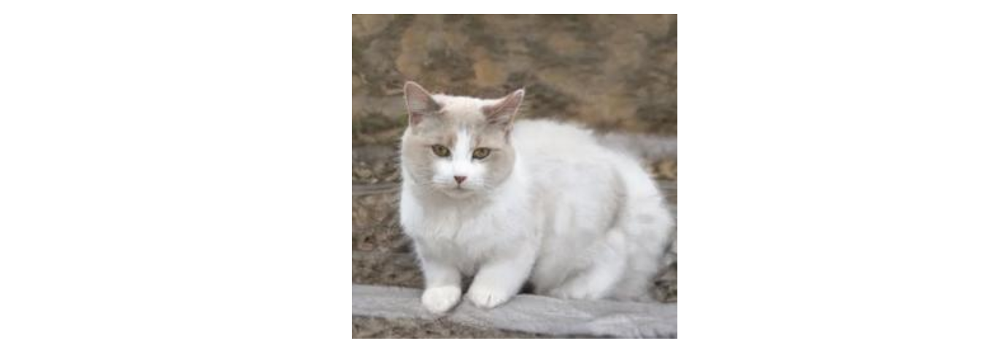

# Discriminator

Generative adversarial networks (GANs) are composed of two networks, a generator, and a discriminator. In this tutorial, we will look at how the discriminator works. 

## What is a classifier?

Look at this picture:



Without much effort, you know this is a picture of a cat. Even though it has four legs and a tail like a dog, you can be 100% certain this is a cat and not a dog. A neural network classifier aims to perform the same operation that you just did, classifying this image as "cat", and not "dog".

A classifier is a neural network where it takes in features, and it output the probabilities for a set of categories. For example, if we fed the image of a cat into the classifier, it produces a set of probabilities, where the sum of all the probabilities is `1`. 

In the beginning, it does a lousy job, classifying `0.5` for both the `cat` and `dog` class. This means that the model thinks this image has a 50% likelihood of this image is a cat, and another 50% is a dog. 


This is when we correct the model so it can improve its predictions. We will feed the correct answers, i.e. `1` for cat, and `0` for dog, and the model will calculate how far off is its prediction from the correct labels, using the "cost function". 

With the cost function, we can update those internal parameters, call "weights", in the network, according to the gradient of this cost function, to get better at predicting cats and dogs the next time. After we show the model thousands of pictures of cats and dogs, it will tune its weights to learn what a cat looks like and what a dog looks like.

# Discriminator is a classifier

The discriminator is a classifier that determines if the input samples are real or fake. These input samples can be real samples coming from the training data, or fake coming from the generator. 

Initially, it can perform poorly, misclassifying fake samples as `real`. The weights of the discriminative network are updated so to decrease its classification error. After turning its weights for a few rounds, it gets better at distinguishing between real and fake samples. 

In probabilistic terms, the discriminator models the probability of a fake sample given a set of inputs `X`. In a multiclass context, the discriminator models the likelihood of a sample is a particular class.


For example, given an image of a one-dollar bill generated by the generator, if the discriminator determines a 13% probability that this is a fake bill, the discriminator thinks that this is a real one-dollar note. The cost function, in this case, a binary cross-entropy loss ([torch.nn.BCEWithLogitsLoss](https://pytorch.org/docs/stable/generated/torch.nn.BCEWithLogitsLoss.html)) is minimized when training a standard binary classifier with a sigmoid output.

## In summary

The discriminator is a classifier that aims to capture the conditional probability `P(y|x)`. It learns to model the probability of an example being real or fake given that set of input features. The output probabilities from the discriminator are classification labels.

The goal of discriminative models is to detect fake generated data, so the discriminative neural network is trained to minimise the final classification error. It learns to distinguish between the different classes by looking at both real samples and fake ones created by the generator and tries to tell which ones are real and which ones are fake.

## PyTorch Code

Taken from [Goodfellow, Ian, et al. "Generative Adversarial Networks"](https://github.com/jinglescode/generative-adversarial-networks/blob/main/tutorials/01%20Intuition%20Behind%20GANs/assets/Generative%20Adversarial%20Networks.pdf) paper:

> The adversarial modeling framework is most straightforward to apply when the models are both multilayer perceptrons. We also define a second multilayer perceptron D(x; θd) that outputs a single scalar. D(x) represents the probability that x came from the data rather than pg. We train D to maximize the probability of assigning the correct label to both training examples and samples from G. 

We will build the discriminator with four layers. The network takes in image tensor and returns a single value, the probability of this image is real or fake. As the size of MNIST images is 28x28, we will flatten the image, which gives us an input dimension of `784`.

```python
class Discriminator(nn.Module):
    '''
    Discriminator Class
    Parameters:
        in_dim: int, default: 784
          the dimension of the input (MNIST images are 28x28, so 784 so is the default)
        hidden_dim: int, default: 128
          the inner dimension
        out_dim: int, default: 1
          default 1 because we returns a 1-dimension tensor representing fake/real
    '''
    def __init__(self, in_dim=784, hidden_dim=128, out_dim=1):
        super(Discriminator, self).__init__()

        dims = [hidden_dim*4, hidden_dim*2, hidden_dim]

        self.layers = nn.Sequential(
            self.discriminator_block(im_dim, dims[0]),
            self.discriminator_block(dims[0], dims[1]),
            self.discriminator_block(dims[1], dims[2]),
            nn.Linear(dims[2], out_dim)
        )

    def forward(self, x):
        return self.layers(x)
    
    def discriminator_block(self, input_dim, output_dim):
        '''
        A discriminator neural network layer, with a linear transformation 
        followed by an nn.LeakyReLU activation with negative slope of 0.2 
        '''
        return nn.Sequential(
          nn.Linear(input_dim, output_dim),
          nn.LeakyReLU(negative_slope=0.2)
      )
```
