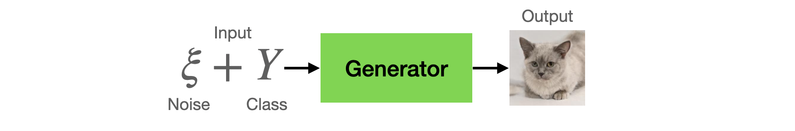
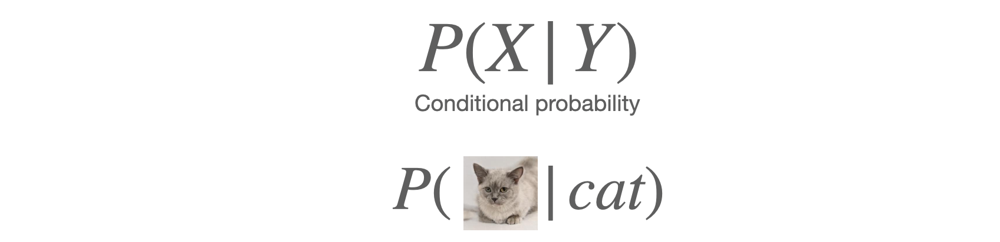
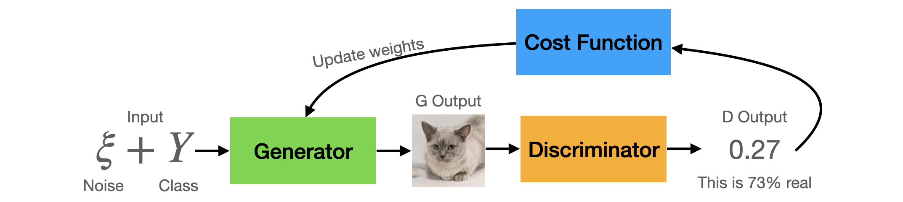

# Generator

Generative adversarial networks (GANs) are composed of two networks, a generator, and a discriminator. In the previous tutorial, we have seen how the [discriminator](https://github.com/jinglescode/generative-adversarial-networks/tree/main/tutorials/02%20Discriminator) works, in this tutorial, we will look at how the generator works. 

## What are the inputs and outputs?

The goal of a generator is to produce samples based on an input feature. There are two input features that we fed into the generator, 1) class and 2) noise. 



**Class**. If we have trained our model with images of cats and dogs, then by requesting for a "cat", we expect the generator to output an image of a cat that looks great. If our model is only trained for one class, then this input feature is not required.

**Noise**. After training a generative model with cat images, we expect our model to be able to [generate a diverse range of cats](https://thesecatsdonotexist.com/). Because we do not want to get the same cat image every time, thus we also input a noise vector, which is a set of random values. This random noise provides the model a different input feature. It can help us generate realistic and diverse representations, such as white cats or orange cats, Persian or Bengal, standing up or lying down.

Thus, a noise vector (and sometimes with a class `y`) is fed in as input into the generator neural network; it will generate an image–realistic and diverse representations of class `y`. We design our generator to output a tensor of shape `[channel, width, height]`, wherein the case of generating an image, we tend to represent an image with three channels (for the three colors, Red, Green, Blue). If you are generating music, maybe you only need `[channel, time]`.

This noise vector also approximates the class's sample distribution, where common features will have more chance of being generated than rare occurrences. For example, for the class "cat", cats with pointy ears are more likely to be generated if the dataset contains many cats with pointed ears. While a cat that is yawning may be harder to get caught on camera; thus, it is less likely to generate a yawning cat. 

## How the generator learns?

First, we fed a noise vector and a class (`y`) into the generator (`G`), the neural network computes and produces a set of features (`G(z)`)–an image of what the model thinks a cat looks like. 



This is the conditional probability of features `X` given the class `Y`. The generator models the probability of the feature `x` given class label `y`. So the model aims to maximize its probability of producing an image of a cat if given the class label "cat".

This generated image is fed into the discriminator (`D`), and it performs classification (`D(G(Z)`) and produces a probability of the data belongs to class `y`. In other words, it determines how real and how fake it thinks it is based on input.



With the discriminator's predictions, we can compute a cost function (`g_loss`) that looks at how far the samples produced by the generator are considered real by the discriminator. The generator will improve and tune its weights to improve this metric–the probability of the discriminator thinks that the image is real (`p(x)`. The difference between the actual class and the output are used to update the weights and improve the model, to generate more realistic images that can fool the discriminator.

When we have trained a generator that can fool the discriminator and fool humans to think it is real, we can save the generator neural network. We can feed noise input vectors to this generator, and it will generate realistic samples. With different noise vectors, it can generate a diverse range of samples. Thus, we can generate [these cats that do not exist](https://thesecatsdonotexist.com/).

## In summary

The goal of generative models is to learn to produce realistic samples to fool the discriminator, so the generative neural network is trained to maximize the final classification error. Like an artist that can paint pictures that look like actual paintings or sceneries, or generate pictures of cats with different variations, that the discriminator could not tell real from the generated data.

## PyTorch Code

The generator network takes in a noise vector, apply non-linear transformations through 4 `linear+batchnorm+relu` blocks. Then output a tensor of size `784` to match the output size of a flattened MNIST image, `28x28`.

```python
class Generator(nn.Module):
    '''
    Generator Class
    Parameters:
        z_dim: int, default: 10
          the dimension of the noise vector
        im_dim: int, default: 784
          the dimension of the images, fitted for the dataset used
          (MNIST images are 28x28, so 784 so is the default)
        hidden_dim: int, default: 128
          the inner dimension size
    '''
    def __init__(self, z_dim=10, im_dim=784, hidden_dim=128):
        super(Generator, self).__init__()

        dims = [hidden_dim, hidden_dim*2, hidden_dim*4, hidden_dim*8]

        self.gen = nn.Sequential(
            self.generator_block(z_dim, dims[0]),
            self.generator_block(dims[0], dims[1]),
            self.generator_block(dims[1], dims[2]),
            self.generator_block(dims[2], dims[3]),
            nn.Linear(dims[3], im_dim),
            nn.Sigmoid()
        )

    def forward(self, noise):
        return self.gen(noise)
    
    def generator_block(self, input_dim, output_dim):
        '''
        A generator neural network layer, with a linear transformation, batchnorm and relu.
        '''
        return nn.Sequential(
            nn.Linear(input_dim, output_dim),
            nn.BatchNorm1d(output_dim),
            nn.ReLU(inplace=True),
        )
```